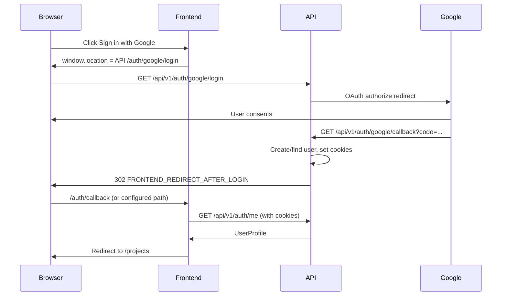

# Auth And Session

Backend-owned auth. **Not** Supabase Auth. Session is **httpOnly cookies** set by the API.

## Cookies

| Cookie | Purpose | Typical max-age |
|--------|---------|-----------------|
| `access_token` | JWT access token | 60 minutes |
| `refresh_token` | Opaque refresh token (hashed server-side) | 7 days |

Both: `path=/`, `SameSite=Lax`, `HttpOnly`, `Secure` only in production.

Frontend **must not** read or write these in JavaScript. Use `credentials: 'include'` on every API request.

## Google OAuth flow



### Frontend implementation

**Sign in button** — full page navigation (not XHR):

```text
{API_BASE_URL}/api/v1/auth/google/login
```

Example: `http://localhost:8000/api/v1/auth/google/login`

**Callback page** (`FRONTEND_REDIRECT_AFTER_LOGIN`, e.g. `http://localhost:3000/auth/callback`):

1. On mount, `GET {API_BASE_URL}/api/v1/auth/me` with `credentials: 'include'`
2. On 200 → redirect to `/projects` (or intended deep link)
3. On 401 → show error + link to retry login

No query params carry tokens; cookies were set on the 302 from the API domain.

### Google Cloud / env alignment

Redirect URI registered in Google Console must **exactly** match backend `GOOGLE_REDIRECT_URI`:

```text
http://localhost:8000/api/v1/auth/google/callback
```

Frontend origin must be in backend `ALLOWED_ORIGINS` for CORS (e.g. `http://localhost:3000`).

## Session maintenance

### Current user

```http
GET /api/v1/auth/me
```

Response `UserProfile`:

```json
{
  "id": "uuid",
  "email": "founder@example.com",
  "username": "founder",
  "is_active": true,
  "created_at": "2026-05-20T00:00:00Z",
  "role": { "id": "uuid", "name": "participant", "description": "..." }
}
```

### Refresh (on 401)

```http
POST /api/v1/auth/refresh
```

Body: none. Sends `refresh_token` cookie. Response:

```json
{ "status": "ok", "user_id": "uuid" }
```

New cookies set on response. Retry the failed request once.

### Logout

```http
POST /api/v1/auth/logout
```

Clears cookies server-side. Redirect to marketing/login page.

## Auth guard pattern (React/Next)

```typescript
async function apiFetch(path: string, init?: RequestInit) {
  const base = process.env.NEXT_PUBLIC_API_BASE_URL!;
  let res = await fetch(`${base}/api/v1${path}`, {
    ...init,
    credentials: 'include',
    headers: { 'Content-Type': 'application/json', ...init?.headers },
  });
  if (res.status === 401) {
    const refreshed = await fetch(`${base}/api/v1/auth/refresh`, {
      method: 'POST',
      credentials: 'include',
    });
    if (refreshed.ok) {
      res = await fetch(`${base}/api/v1${path}`, {
        ...init,
        credentials: 'include',
        headers: { 'Content-Type': 'application/json', ...init?.headers },
      });
    }
  }
  return res;
}
```

## Errors

| Status | Meaning |
|--------|---------|
| 401 | Not logged in or token expired |
| 403 | Logged in but wrong role (rare on v1 founder routes) |
| 404 | Resource not found or **not owned** by user (projects) |

Do not leak whether a project ID exists for other users — treat 404 as "not found".

## Out of scope v1

- Email/password login
- GitHub OAuth
- Sign-up form (Google creates user on first login)
